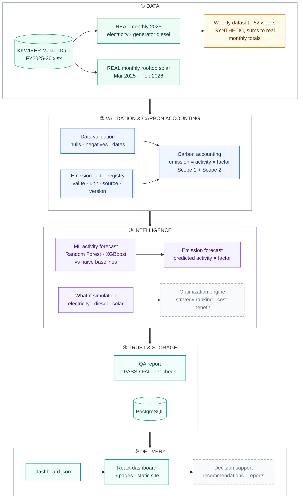

# Carbonomics-AI

## AI-Driven Carbon Intelligence and Decision Support Framework

Carbonomics-AI is an AI-powered decision support system designed to help institutions measure, analyze, predict, and optimize carbon emissions using machine learning and sustainability analytics.

Unlike conventional carbon management systems that primarily focus on reporting, Carbonomics-AI combines carbon accounting, predictive analytics, scenario simulation, and optimization to support data-driven sustainability decisions.

---

## Project Vision

The objective of Carbonomics-AI is to develop an intelligent platform that enables organizations to:

- Measure carbon emissions accurately
- Predict future emission trends
- Identify major emission drivers
- Evaluate sustainability strategies through simulation
- Optimize emission reduction decisions
- Support long-term environmental planning

---

## Problem Statement

Traditional carbon management systems mainly emphasize emission reporting and regulatory compliance. While these systems provide valuable insights into current emissions, they often lack predictive capabilities and decision-support mechanisms.

Carbonomics-AI addresses this limitation by integrating carbon accounting, machine learning, simulation, and optimization into a unified framework that enables organizations to move from analysis to action.

---

## Core Features

- Carbon Emission Calculation
- GHG-Based Carbon Accounting
- Machine Learning Prediction
- Feature Importance Analysis
- Scenario-Based Simulation
- Optimization Engine
- Decision Support System
- Interactive Dashboard
- Sustainability Reports
- Data Visualization

---

## System Architecture

Carbonomics-AI turns the campus energy log into numbers you can act on. Every emission is
**activity × emission factor** (GHG Protocol). Machine learning forecasts **activity**
(kWh, litres), never emissions directly, so there is no target leakage.



Green = real data, amber = synthetic, dashed grey = planned (optimization, decision support). Everything else is built and tested.

| Layer | What it does | Where |
|---|---|---|
| ① Data | Real monthly electricity, generator diesel and rooftop solar from the Master Data; a 52-week **synthetic** dataset that sums to the real monthly totals | `data/real/`, `scripts/make_synthetic_weekly.py` |
| ② Accounting | Validates the data, then computes Scope 1 + Scope 2 with cited factors (CEA V21.0, IPCC 2006) | `src/clean_data.py`, `src/emission_factors.py`, `src/process_dataset.py` |
| ③ Intelligence | Forecasts weekly activity against baselines; simulates what-if scenarios on the real monthly baseline | `src/ml/forecast_weekly.py`, `src/simulation.py` |
| ④ Trust & storage | QA report with PASS/FAIL per check; optional PostgreSQL upsert | `src/validation/`, `src/database/`, `database/` |
| ⑤ Delivery | Exports one JSON file read by a static React site (no Python server needed) | `src/dashboard_export.py`, `dashboard/` |

### Key numbers (real data, calendar year 2025)

| Source | Activity | Emissions |
|---|---|---|
| Grid electricity (Scope 2) | 1,059,147 kWh | 752.0 tCO₂e |
| Generator diesel (Scope 1) | 4,100 L | 11.9 tCO₂e |
| Rooftop solar (avoided, reported separately, not netted) | 21,720 kWh | 15.42 tCO₂e avoided |

Electricity and generator diesel are about **20.5%** of the 3,719.74 tCO₂e campus footprint.
Commuting and wastewater make up most of the rest and have no time series yet.

---

## Tech Stack

| Area | Tools |
|---|---|
| Language | Python 3, JavaScript |
| Data processing | Pandas, NumPy, openpyxl |
| Machine learning | Scikit-learn (Random Forest), XGBoost |
| Plots (pipeline) | Matplotlib, Seaborn |
| Dashboard | React, Vite, Tailwind CSS, Recharts |
| Database | PostgreSQL (psycopg2) |
| Testing | pytest |
| Hosting | Vercel / Netlify (static site) |
| Version control | Git, GitHub |

---

## Development Roadmap

### Phase 1 – Research & Planning

- [x] Literature Survey
- [x] Problem Identification
- [x] Research Gap Analysis
- [x] System Architecture
- [x] Research Methodology
- [x] Repository Setup

### Phase 2 – Carbon Accounting

- [x] Carbon Emission Calculator
- [x] GHG Emission Factors
- [x] Dataset Integration
- [x] Carbon Footprint Report
- [x] Real rooftop solar generation and avoided emissions (reported separately, not netted)

### Phase 3 – Machine Learning

- [x] Weekly dataset validation (synthetic, calibrated to real monthly totals)
- [x] Weekly activity forecast: Random Forest and XGBoost vs naive and mean baselines (time-based split)
- [x] Model Evaluation (MAE, RMSE, R2)
- [x] Emission forecast: weekly Scope 1 + Scope 2 = predicted activity x factor, with baselines
- [x] Trained models saved to `outputs/models/` (regenerated by the pipeline)
- [ ] Forecast on real weekly data (waiting for data)
- [ ] Scope 3 forecasting (no weekly activity data yet)

### Phase 4 – Analytics & Dashboard

- [x] Feature Importance Analysis (model comparison in Forecast page)
- [x] React dashboard (Vite + Tailwind + Recharts, 6 pages, static site — see `dashboard/`)
- [x] Trend Analysis (Trends page: real monthly + synthetic weekly)
- [x] KPI Monitoring (Overview page: annual tCO₂e, scope share, coverage)

### Phase 5 – Scenario Simulation

- [x] What-if simulation (electricity, generator diesel, solar offset — `src/simulation.py` + React Simulation page)
- [x] Renewable Energy Simulation (solar offset slider, 100 kWp preset, existing real solar shown as reference)
- [ ] Electric Vehicle Adoption (no time series yet)
- [x] Energy Efficiency Simulation (LED retrofit preset — illustrative assumption)

### Phase 6 – Optimization

- [ ] Strategy Comparison
- [ ] Constraint-Based Optimization
- [ ] Cost-Benefit Analysis
- [ ] Recommendation Engine

### Phase 7 – Web Application

- [x] React dashboard (static site, replaces Streamlit plan — `dashboard/`, deployable on Vercel/Netlify)
- [ ] CSV Upload
- [ ] User Interaction (basic sliders on Simulation page)
- [ ] Report Generation

### Phase 8 – Deployment

- [x] Automated tests (40 pytest tests)
- [ ] Documentation
- [ ] Performance Optimization
- [ ] Cloud Deployment

---

## Project Status

**Status:** Under Active Development

The project is being developed incrementally. Each module will be implemented, tested, documented, and released through regular commits.

---

## Research Foundation

Carbonomics-AI is inspired by recent research in:

- Carbon Accounting
- Machine Learning
- Explainable Artificial Intelligence
- Sustainability Analytics
- Optimization Techniques
- Decision Support Systems

---

## Repository Structure

```
Carbonomics-AI/
│── data/real/        real monthly electricity, generator diesel and solar (Master Data)
│── data/synthetic/   weekly SYNTHETIC dataset + metadata (assumptions, seed)
│── data/processed/   validated weekly dataset
│── src/              emission_factors, calculations, clean_data, process_dataset,
│                     simulation, dashboard_export
│── src/ml/           forecast_weekly (models + baselines), visualizer
│── src/validation/   QA checks and report
│── src/database/     PostgreSQL manager
│── scripts/          run_pipeline.py (full flow), make_synthetic_weekly.py, verify_db.py
│── database/         schema.sql, import.sql
│── tests/            pytest
│── outputs/          emissions, forecast metrics, plots, QA report
│── dashboard/        React dashboard (reads public/data/dashboard.json)
│── docs/
│── requirements.txt
```

## Run

```
pip install -r requirements.txt
python scripts/run_pipeline.py
pytest tests

# dashboard
cd dashboard
npm install
npm run dev
```

The weekly dataset is SYNTHETIC: only the monthly totals are real. See
`docs/weekly_synthetic_forecast.md` for what is real, what is assumed and how to read the scores.

---

## Future Scope

Future versions of Carbonomics-AI will include:

- Real-time IoT data integration
- Carbon credit estimation
- Net-Zero planning
- Renewable energy optimization
- Multi-institution benchmarking
- AI-powered sustainability assistant

---

## License

Copyright © 2026 Team Carbonomics. All rights reserved.
This code is published for viewing and evaluation only. See LICENSE.
For permission to use it, contact Carbonomics.app@gmail.com

---

## Author

© 2026 Sanket Chaudhari 

This project is developed as an academic and portfolio project.
Unauthorized plagiarism or direct submission as one's own academic work is prohibited.

B.Tech Artificial Intelligence & Data Science

GitHub: https://github.com/sanket1035

LinkedIn: https://linkedin.com/in/sanketchaudhari1035
